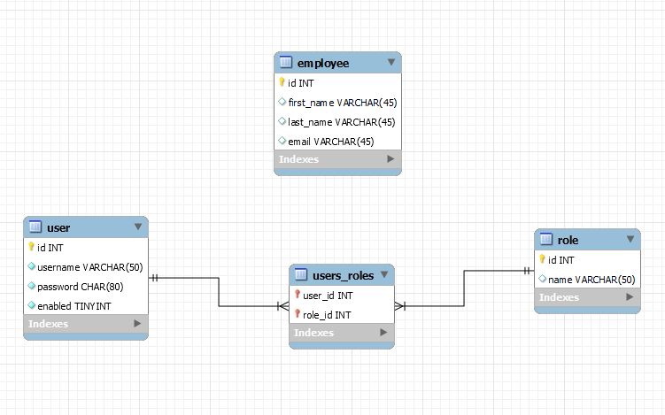
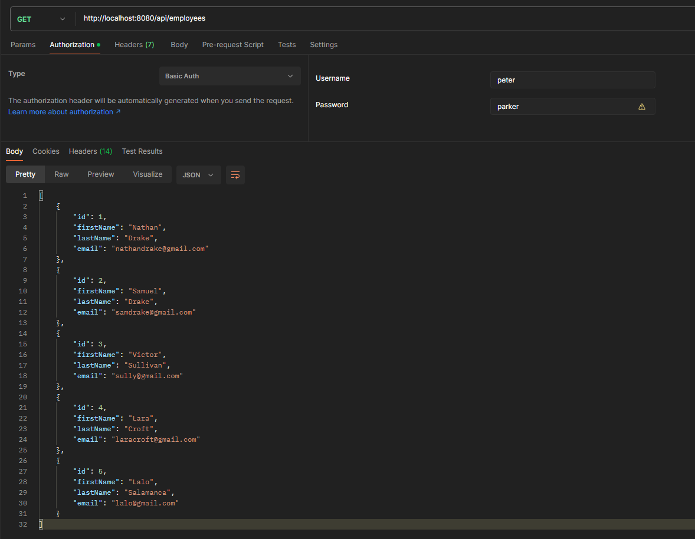
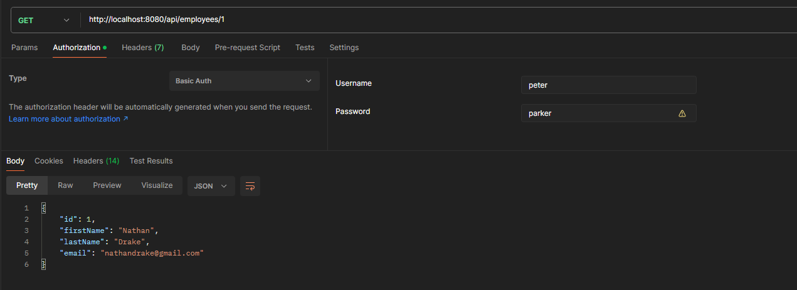
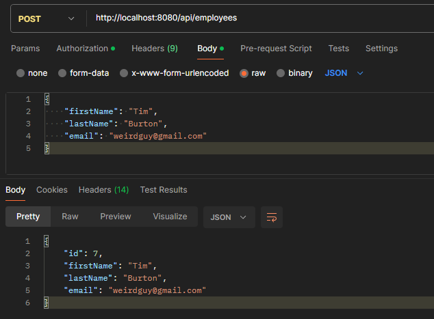
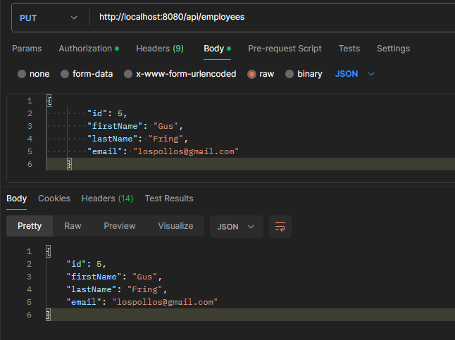
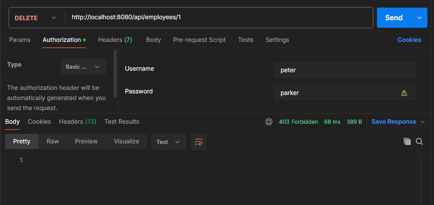

# Spring Boot 3 REST API
- **with Spring Security - Basic Authentication**
- **CRUD implementation using Hibernate/JPA ORM**
- **using JDBC for database interaction**
- **Security handled through Hibernate/JPA**
- **Custom exception handling**

Developed on:
- Java Version: 18.0.2.1
- Spring Boot: 3.2.2
- Package Manager: Maven (https://start.spring.io/)
- Dependencies:
    1. Spring Web: For building web, including RESTful, applications using Spring MVC. Uses Apache Tomcat as the default embedded container.
    2. Spring Data JPA: Persist data in SQL stores with Java Persistence API using Spring Data and Hibernate.
    3. MySQL Driver: MySQL JDBC driver.
    4. Spring Boot Dev Tools: Provides fast application restarts, LiveReload, and configurations for enhanced development experience.
    5. Spring Security: Highly customizable authentication and access-control framework for Spring applications.

# How to run -- Installation
- To run this project, you need to have Java installed on your system.
- Spring Boot 3.2.2 requires at least Java 17 or above.
  
  
- Once you have installed the right version of Java, you can follow these steps:

1. Clone the repository.
2. Use the SQL scripts in the repository to set up the employee table in MySQL.
3. In `src/main/resources/application.properties`, connect to your MySQL database by changing these three parameters:
    ```
    spring.datasource.url=jdbc:Insert Link Here
    spring.datasource.username=Insert Username Here
    spring.datasource.password=Insert Password Here
    ```
4. Run `RestcrudApplication.java`.
5. The default port is `8080`.
6. Use a client tool like Postman to make the API calls.
7. Check below for the various API methods implemented and how to use them.

# NOTE
You can create your own databse table directly on MySQL Workbench(Skip step 2).  
Step 3 is still necessary to establish a database connection.  
OPTIONAL: Use this in ``application.properties`` to autocreate the table from java code: ``spring.jpa.hibernate.ddl-auto=create``   
**Make sure to change the entity name to your table name, and other subsequent updates(objects and methods related to that entity/class)**

# API Requirements
A REST API for the Employee Directory 

REST clients should be able to:   
- Get a list of employees
- Get a single employee by id
- Add a new employee
- Update an employee
- Delete an employee
  
Main resource / entity: **employees**

**HTTP methods to assign action on resource**

| HTTP Method | Endpoint | CRUD Action|  
|----------|----------|----------|  
| POST    |/api/employees| Create a new entity    |  
| GET   |/api/employees| Read a list of entities   |  
| GET   |/api/employees/{employeeId}| Read a single entity    |
| PUT    |/api/employees| Update an existing entity    |  
| DELETE    |/api/employees/{employeeId}| Delete an existing entity    |  

For POST and PUT make sure the body sent is in JSON format.

# Security
**Authentication Scheme used:** Basic Authentication, a simple authentication scheme built into the HTTP protocol.  
The client sends HTTP requests with the Authorization header that contains the word Basic followed by a space and a   
base64-encoded string username:password  
  

**Password stored in the database is encrypted using BCrypt algorithm**

Three layers of security is implemented based on:
- EMPLOYEE
- MANAGER
- ADMIN   
  

  | User ID | Password | Roles                  |
  |---------|----------|------------------------|
  | peter   | parker   | EMPLOYEE               |
  | mary    | jane     | EMPLOYEE, MANAGER      |
  | harry   | osborn   | EMPLOYEE, MANAGER, ADMIN |

| HTTP Method | Endpoint                       | CRUD Action     | Role      |
|-------------|--------------------------------|-----------------|-----------|
| GET         | /api/employees                 | Read all        | EMPLOYEE  |
| GET         | /api/employees/{employeeId}    | Read single     | EMPLOYEE  |
| POST        | /api/employees                 | Create          | MANAGER   |
| PUT         | /api/employees                 | Update          | MANAGER   |
| DELETE      |/api/employees/{employeeId}     | Delete employee | ADMIN     |

# Database EER Diagram


## Tables 
Table: employee  

| id   | first_name | last_name | email                 |
|------|------------|-----------|-----------------------|
| 1    | Nathan     | Drake     | nathandrake@gmail.com |
| 2    | Samuel     | Drake     | samdrake@gmail.com    |
| 3    | Victor     | Sullivan  | sully@gmail.com       |
| 4    | Lara       | Croft     | laracroft@gmail.com   |
| 5    | Lalo       | Salamanca | lalo@gmail.com        |

Table: user

| id   | username | password | enabled |
|------|----------|----------|---------|
| 1    | peter    | $2a$10$CDS9AvXvbLnKky4MO3KmgeZGdBSXsZQU6QxKqUqfMj2Os.NC2sA2C    | 1       |
| 2    | mary     | $2a$10$8N00SjMPB58fOUkZGtecKuJZnpUirqN2rODK7S1vMU5MrEcCsnAYW    | 1       |
| 3    | harry    | $2a$10$DAGpObGwTq1TO/ULTffeJ.n5OAHZ/rNIH5LvOMOkeQlGqHPSCzpFO | 1       |

Table: role

| id | name          |
|----|---------------|
| 1  | ROLE_EMPLOYEE |
| 2  | ROLE_MANAGER  |
| 3  | ROLE_ADMIN    |

Table: user_roles

| user_id | role_id |
|---------|---------|
| 1       | 1       |
| 2       | 1       |
| 3       | 1       |
| 2       | 2       |
| 3       | 2       |
| 3       | 3       |


# Postman, API calls and expected Output

- Make sure your select Authorization Type as **Basic Auth** 
- Body should be in **Raw - JSON** format
- Perform GET calls after every POST, PUT and DELETE actions to check the updated database


## GET : List of Employees

## GET : Single Employee

## POST

## PUT 

## DELETE : Single Employee

## Performing Unauthorised calls
Username: peter only has EMPLOYEE level access. As such, performing ADMIN level actions(DELETE) will throw a **403 Forbidden** status code.  


# Application Architecture
[EMPLOYEE REST CONTROLLER] <--> [EMPLOYEE SERVICE] <--> [EMPLOYEE DAO] <--> [DATABASE]   

Any other DAOs'(Skills DAO, Payroll DAO, etc...) can be connected to Employee Service.
# Future builds?
Rest Controller, Employee Service and Employee DAO layers can be eliminated, and replaced by **Spring Data REST** & **Spring Data JPA**.  
Project: https://github.com/SumantaKS/REST-API-CRUD-Spring-Data-REST-and-JPA
This will reduce boilerplate codes, but at the cost of custom implementation of Business Logic, Rest Controller and database interaction methods.  

